# Introduction    

- The purpose of this document is to undertand the structure of the project and how the things are implemented.   
   
    - The project focuses on implementing platoon control for multi vehicle systems arranged in a linear manner where every robot follows the robot exaclty in front of it and the very first robot in the platoon does the decision making to avoid obctacles and reaching to the goal.     
    - This project uses Turtlebot3 hardware (burger and waffle_pi) robots along with ROS2-Humble software stack on Ubuntu-22 OS.       
    - The guide to setup this project has been provided in the [*README*](README.md) file.     
    - This document will mainly focus on how the things are working and what files are involved for a particular task.      

# Project Structure     

- This is the overall structure of this project with only the important files listed below : 

    ```bash 
    ├── DEBUGGING.md                       # debug instructions          
    ├── LICENSE                            # license information
    ├── PROJECT_GUIDE.md                   # complete project understanding
    ├── README.md                          # main guide to setup & implement project
    ├── TURTLEBOT3_HARDWARE_SETUP.md       # turtlebot3 hardware setup guide
    ├── media/                             # pictures/plots used as contents
    ├── platoon                            # meta package for containing other sub packages
    │   ├── CMakeLists.txt
    │   └── package.xml
    ├── platoon_control                    # package to implement platoon control
    │   ├── CMakeLists.txt
    │   ├── launch
    │   │   └── platoon_control.launch.py  # run platoon control nodes for all the robots
    │   ├── package.xml
    │   ├── params
    │   │   └── platoon_control.yaml       # specify platoon structure
    │   └── src
    │       ├── formation_control_node.py  # platoon control node
    │       └── lane_changing.py           # goal navigation node
    ├── robot_bringup                      # package to bringup robots with namespaces
    │   ├── CMakeLists.txt
    │   ├── launch
    │   │   ├── bringup.launch.py          # Main bringup file to run the robot
    │   │   ├── ld08.launch.py
    │   │   └── robot_state_publisher.launch.py
    │   ├── package.xml
    │   ├── param                          # namespacing nodes and specifying start position    
    │   │   ├── burger.yaml
    │   │   ├── waffle_pi.yaml
    │   │   └── waffle.yaml
    │   └── src
    │       ├── robot_trajectory_node.py
    │       └── update_ns_param.py         # file to replace dummy namespace in param folder
    ├── robot_teleop                       # package to teleoperate the robot 
    │   ├── CMakeLists.txt
    │   ├── package.xml
    │   └── src
    │       └── teleop_keyboard.py         # teleoperation node
    └── updated_turtlebot3_node            # turtlebot3_node package with updates to initialize custom odometry
        ├── CMakeLists.txt
        ├── include
        │   └── updated_turtlebot3_node
        │       ├── devices/
        │       ├── odometry.hpp
        │       ├── sensors/
        │       └── turtlebot3.hpp
        ├── package.xml
        ├── param
        │   ├── burger.yaml
        │   ├── waffle_pi.yaml
        │   └── waffle.yaml
        └── src
            ├── devices/
            ├── node_main.cpp              # main executable node of updated_turtlebot3_node pkg
            ├── odometry.cpp               # file to initialize and update odometry
            ├── sensors/
            └── turtlebot3.cpp
    ```   

- The main ROS2 packages that are doing the work are as follows :    

    1. [***robot_bringup***](robot_bringup/) :     

        - This package contains the launch files for bringing up (starting the robot with all the sesors and data) contained in its [*launch*](robot_bringup/launch/) folder.    
        - The [*launch*](robot_bringup/launch/) folder contains three launch files    

            1. [*bringup.launch.py*](robot_bringup/launch/bringup.launch.py)    

                - This file contains the code to start all the nodes from different packages and also from the other launch files.    
                - It loads the other 2 launch files and also the [*updated_turtlebot3_ros*](updated_turtlebot3_node/src/node_main.cpp) node from the package [*updated_turtlebot3_node*](updated_turtlebot3_node/).   
                - It also loads the [*param*](robot_bringup/param/) data to include the information such as start position, namespaced nodes & topics and many more.     

            2. [*ld08.launch.py*](robot_bringup/launch/ld08.launch.py)      

                - It loads the lidar driver node to start laser sensing and publishing of sensor data.   
                - It also runs the node with namespace.     

            3. [*robot_state_publisher.launch.py*](robot_bringup/launch/robot_state_publisher.launch.py)     

                - This launch file uses the urdf data of the robot to publish the transforms between all the frames attached to different parts/sensors of the robot.     
                - The file replaces default frame names to the namespaced frame names to identify each robot in the ROS2 environment.       

        - The [*src*](robot_bringup/src/) folder contains 2 important files    

            1. [*robot_trajectory_node.py*](robot_bringup/src/robot_trajectory_node.py)   

                - This ros2 node was supposed to be used within the [*bringup.launch.py*](robot_bringup/launch/bringup.launch.py) file to publish the trajectory of the robot as a *Path* object wrt. the world frame.      
                - But its code has been commented within the [*bringup.launch.py*](robot_bringup/launch/bringup.launch.py) file as it was creating issues while running multiple robots together.     
                - Maybe you can figure out the issue and debug it accordingly.      

            2. [*update_ns_param.py*](robot_bringup/src/update_ns_param.py)     

                - I made this python file to automate the process of editing the yaml files in [*param*](robot_bringup/param/) folder to replace dummy namespace to to the actual namespace within the SBC of the robot.    
                - This is a one time process to include correct namespace in the yaml file, which is used in the [*bringup.launch.py*](robot_bringup/launch/bringup.launch.py) file.     

        - Rest of the files such as *package.xml*, *CMakeLists.txt* are common for all ros2 packages.       
        - To visualize how this namespacing helped us in this project and why was it important, you can look as these images    

            1. The tf-tree data after bringup of *burger2* robot :   

                <table>
                    <thead>
                        <tr>
                        <th style="text-align:center;">default (without namespace)</th>
                        <th style="text-align:center;">updated (with namespace)</th>
                        </tr>
                    </thead>
                    <tbody>
                        <tr>
                        <td style="text-align:center;">
                            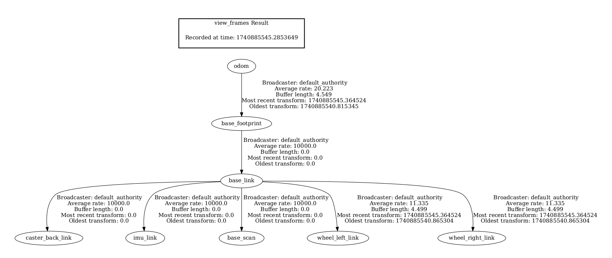
                        </td>
                        <td style="text-align:center;">
                            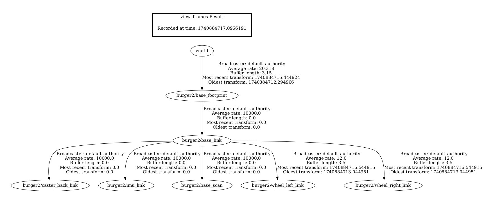
                        </td>
                        </tr>
                    </tbody>
                </table>      

            2. The ROS topics after bringup of *burger2* robot :    

                <table>
                    <thead>
                        <tr>
                        <th style="text-align:center;">default (without namespace)</th>
                        <th style="text-align:center;">updated (with namespace)</th>
                        </tr>
                    </thead>
                    <tbody>
                        <tr>
                        <td style="text-align:center;">
                            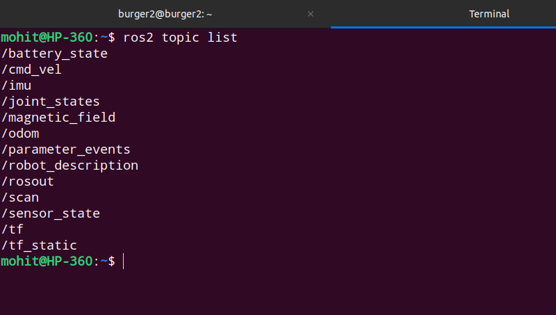
                        </td>
                        <td style="text-align:center;">
                            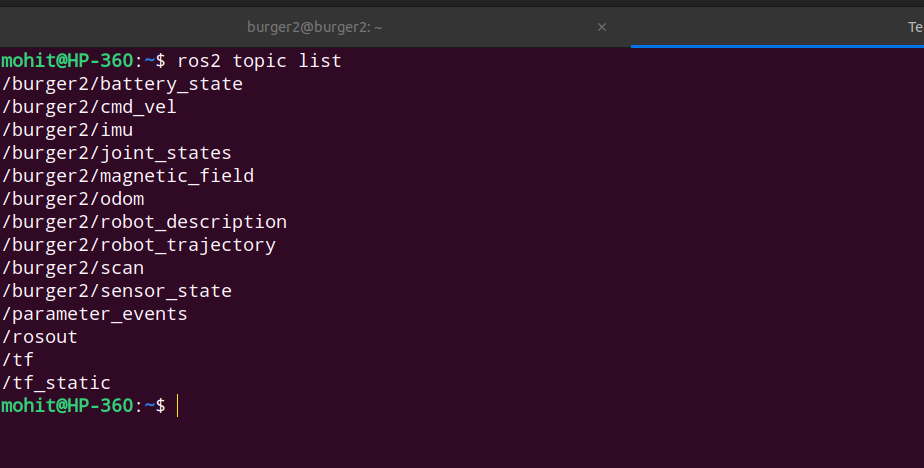
                        </td>
                        </tr>
                    </tbody>
                </table>      

            3. The RQT plot after bringup of *burger2* robot :    

                <table>
                    <thead>
                        <tr>
                        <th style="text-align:center;">default (without namespace)</th>
                        <th style="text-align:center;">updated (with namespace)</th>
                        </tr>
                    </thead>
                    <tbody>
                        <tr>
                        <td style="text-align:center;">
                            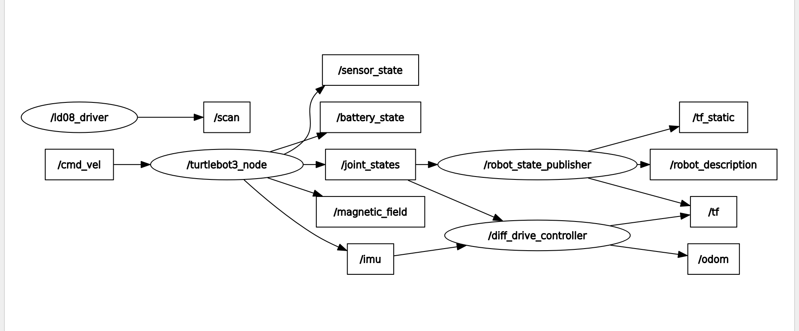
                        </td>
                        <td style="text-align:center;">
                            
                        </td>
                        </tr>
                    </tbody>
                </table>       


        - Now after running three robots together (for a 3 robot linear platoon), the ros2 structure looked like this      

            1. Tf tree after platoon bringup :    

                <div align="left">
                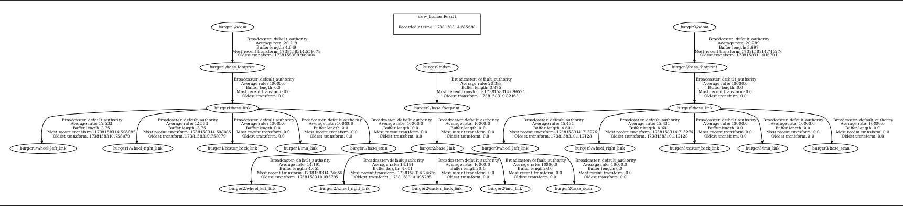
                </div>     

            2. RQT plot after platoon bringup :    

                <div align="left">
                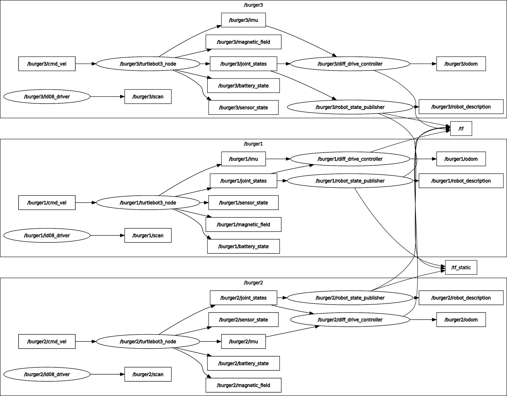
                </div>     

            3. ROS topics after platoon bringup :     

                <div align="left">
                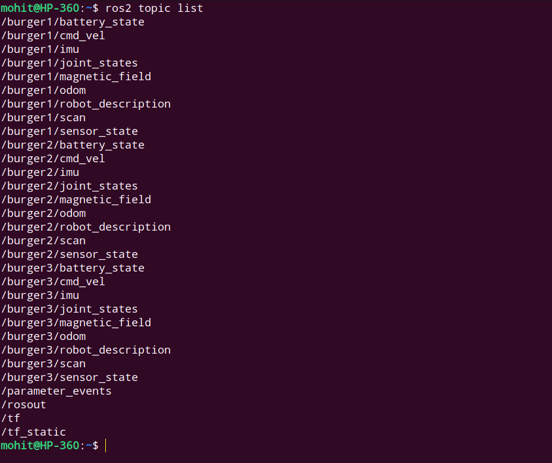
                </div>     

        - The platoon lookout for both hardware and its corresponding rviz data looked like this       

            <table>
                <thead>
                    <tr>
                    <th style="text-align:center;">   Hardware bringup  </th>
                    <th style="text-align:center;">Rviz data</th>
                    </tr>
                </thead>
                <tbody>
                    <tr>
                    <td style="text-align:center;">
                        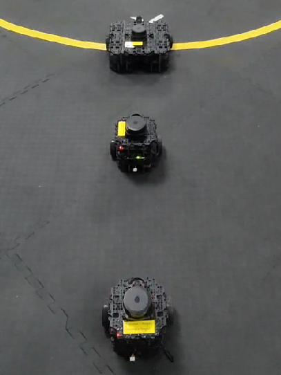
                    </td>
                    <td style="text-align:center;">
                        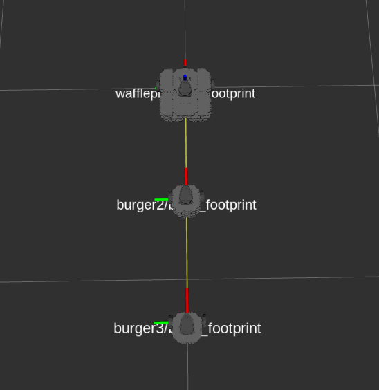
                    </td>
                    </tr>
                </tbody>
            </table>      

        - Now one can easily understand why namepacing was important and how does the ros2 data reflects these changes.     
        - Namespacing allows us to uniquely identify and extract/send information to/from the robot without worrying about others.     

    
    2. [***updated_turtlebot3_node***](updated_turtlebot3_node/) :    

        - This package is an updated version of the robotis's  existing [*turtlebot3_node*](https://github.com/ROBOTIS-GIT/turtlebot3/tree/main/turtlebot3_node) package.    

        - All the files are updated to include the correct file names (begin with `updated`).    

        - The main updates are done in following file    

            1. [*src/odometry.cpp*](updated_turtlebot3_node/src/odometry.cpp)   

                - In this file the *robot_pose_[]* array is initialized with custom (x, y, yaw) value that is declared as a parameter in the [*param*](updated_turtlebot3_node/param/) folder of this package.     
                - The purpose of this update is to initialize the robot during bringup with some custom position to ensure that all the robots are at different positions when bringing them up together.    

        - The [*node_main.cpp*](updated_turtlebot3_node/src/node_main.cpp) file is the main executable node that runs all the other files.     
        - The node name of [*node_main.cpp*](updated_turtlebot3_node/src/node_main.cpp) file is defined with a different name *updated_turtlebot3_ros* within the [*CMakeLists.txt*](updated_turtlebot3_node/CMakeLists.txt).    

    3. [***robot_teleop***](robot_teleop/) :    

        - This package is used to simply teleoperate the robot.    
        - The teleopertion node is named as [*teleop_keyboard.py*](robot_teleop/src/teleop_keyboard.py) present in the [*src*](robot_teleop/src/) folder.    
        - The [*teleop_keyboard.py*](robot_teleop/src/teleop_keyboard.py) node requires two environment variables    

            1. `TURTLEBOT3_MODEL`   
                
                - This variable is used in the node to specify speed limits among different models of the robot.    

            2. `TURTLEBOT3_NAMESPACE`   

                - This environment variable is used to replace the velocity topic names with the namespace to teleoperate a particular robot.   

    4. [***platoon_control***](platoon_control/) :     

        - This is the package where the platoon control and goal navigation with obstacle avoidance is implemented.    
        - The [*launch*](platoon_control/launch/) folder contains [*platoon_control.launch.py*](platoon_control/launch/platoon_control.launch.py) file.     

            - This launch file runs multiple *leader-follower trajectory control* nodes by using the parameters for a set of leader-follower robots.     
            - This set of leader-follower is defined in the [*platoon_control.yaml*](platoon_control/params/platoon_control.yaml) file.     
            - The node to implement leader-follower trajectory control is defined in [*formation_control_node.py*](platoon_control/src/formation_control_node.py) file.     

        - The [*src*](platoon_control/src/) folder contains two important nodes :   

            1. [*formation_control_node.py*](platoon_control/src/formation_control_node.py)     

                - This node uses 2 launch parameters for specifying names of the leader and follower robots.     
                - 2 separate controls are running in this node for the follower to follow the exact trajectory of its leader.    
                - One is a PD based *trajectory control* that ensures that the follower moves along the exact same trajectory of its leader.    
                - Second is a PID based *relative distance control* that ensures that the follower always maintains the same distance (that was present during the start of platoon control) along the trajectory curve of leader.    
                - Final motion commands are send to the follower as a fraction of above two control inputs with 40% weight for trajectory control and 60% weight for relative distance control.     
                - The trajectory of the leader is saved in a queue as its position and yaw.    
                - As the leader moves its position and yaw are appended in the queue and the follower robot takes the oldest element in the queue as its goal (to reach) and as it reaches that goal, that oldest elements is popped out from the queue.    
                - So in this way the elements are added in the queue (as the leader moves) and the older elements are popped out as the follower reaches that position within some threshold.    

            2. [*lane_changing.py*](platoon_control/src/lane_changing.py)    

                - This file implement the goal navigation and obstacle avoidance for a single robot (the leader of the platoon).    
                - The goal navigation is pretty simple which is implemented by calculating the error in the position and orientation of the robot from the goal and feeding it as an error input.     
                - For obstacle avoidance, the lidar data is used.     
                - The lidar data is divided into 2 parts (left view and right view).    
                - The obstacle avoidance is treated as a lane changing problem where the current robot is assumed to be moving in the centre lane.   
                - depending upon the extent of obstacle in the current lane, it decides whether to move in the left lane or the right lane.      
                - The following image shows how the lane change and rotation is triggered :      

                    <div align="left">
                    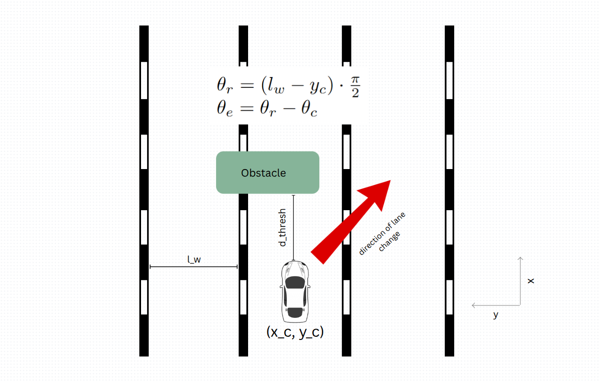
                    </div>     

                - If the lidar data senses some object within the *d_thresh* distance in eiher of its left or right portions, it triggers lane change.    
                - The rotation of the robot is calculated by converting the lane width deviation to the angular terms which basically allows the robot to determine the angular error to shift to the next lane.    
                - The lane width determines how far the robot will be wrt. obstacle while overtaking it.   
                - Here it is assumed tha the obstacle will always be smaller in width wrt. the lane width.  
                - All these lanes are imaginary, used just to show how the obstacle is avoided.     
                - So basically this file takes goal position *(x, y)* as input and moves the robot to that position while avoiding obstacles in between.   
                - Since all the follower robots are following their leaders and the first leader is avoiding obstacles while moving to the goal, this ensures the entire platoon avoids obstacle while reaching to the goal.    
                - In case of moving obstacles, all the robots run independently (without platoon control).     

## Results    

  The video results for different scenarios are as follows :      


  1. [Platoon control for a single set of leader follower](https://drive.google.com/file/d/17kOYZ_MorR6m7O9nQKXy5yPtRre6W99N/view?usp=sharing) :     

      - in this case, the leader was teleoperated from the keyboard using [teleop_keyboard.py](robot_teleop/src/teleop_keyboard.py) node.  
      - the follower was running the [platoon_control.launch.py](platoon_control/launch/platoon_control.launch.py) file.     

  2. [Platoon control with three robots and a static obstacle](https://drive.google.com/file/d/1sQWRfjM5dRVhDmP_qC5Lvjde848lwWqA/view?usp=sharing) :    

      - in this case, the leader was given some goal and it was running the [lane_changing.py](platoon_control/src/lane_changing.py) node.    
      - the other 2 robots were running the [platoon_control.launch.py](platoon_control/launch/platoon_control.launch.py) file and the [platoon_control.yaml](platoon_control/params/platoon_control.yaml) file specified the leader-follower sets.     

  3. [Platoon control with 2 robots and dynamic obstacle](https://drive.google.com/file/d/1nnj8WbNjm0aAW5XdpUUlXpR5N-95k62B/view?usp=sharing) :    

      - in this case, leader was given some goal and it was running the [lane_changing.py](platoon_control/src/lane_changing.py) node.
      - the follower robot was running the [platoon_control.launch.py](platoon_control/launch/platoon_control.launch.py) file which was triggering the [lane_changing.py](platoon_control/src/lane_changing.py) node upon dynamic obstacle detection. 