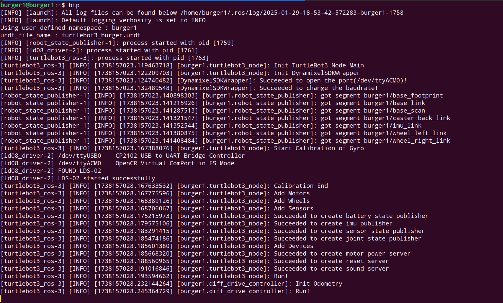
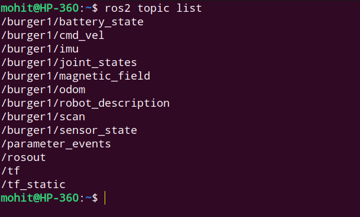

# Introduction
This ros2 package is the implementation of platoon architecture & control being done as part of my BTP under [Prof. Arnab Dey](https://www.iitr.ac.in/~EE/Arnab_Dey).    
This doc provides step by step process to setup this package & check the results on either the turtlebot3 hardware (also compatible with simulations).


## Requirements (apart from Turtlebot3 hardware)

- Ubuntu 22.04 LTS Desktop (in Remote PC)     
- ROS2 Humble (in Remote PC)   


## Install dependencies on Remote PC

- Update your debian packages :

  ```bash
  sudo apt update && sudo apt upgrade -y
  ```

- Make sure you have already setup the `Turtlebot3 hardware & software` before using this package:  

  In case you're looking for a quick guide to setup everything from scratch, you can look at the documentation i prepared - [Turtlebot3 Complete setup guide](https://gist.github.com/ab31mohit/bae0ecfa002597c900024a4800a0c9e4).


- Install gazebo11-classic to simulate (in case you want to) your work & other turtlebot3 dependencies (necessary in all cases) :

  ```bash
  sudo apt install gazebo
  sudo apt install ros-humble-gazebo-*
  sudo apt install ros-humble-cartographer
  sudo apt install ros-humble-cartographer-ros
  sudo apt install ros-humble-tf-transformations
  sudo apt install ros-humble-tf2-tools
  sudo apt install ros-humble-navigation2
  sudo apt install ros-humble-nav2-bringup
  sudo apt install ros-humble-dynamixel-sdk
  ```

## Setting up the project  

### 1. Create a ros2 workspace for this project in your remote PC :

- Open terminal and type these commands :

  ```bash
  cd ~
  mkdir -p ~/btp_ws/src
  cd ~/btp_ws/src
  git clone -b humble-devel https://github.com/ROBOTIS-GIT/turtlebot3_simulations.git
  git clone -b humble-devel https://github.com/ROBOTIS-GIT/turtlebot3_msgs.git
  git clone -b humble-devel https://github.com/ROBOTIS-GIT/turtlebot3.git
  git clone https://github.com/ab31mohit/platoon.git
  cd ~/btp_ws/src/turtlebot3/
  rm -rf turtlebot3_cartographer/ turtlebot3_navigation2/ turtlebot3_example/
  cd ~/btp_ws/
  colcon build --parallel-workers 1
  echo "source ~/btp_ws/install/setup.bash" >> ~/.bashrc
  ```    

    Make sure all the above cloned packages are built without any errors.       
    
    In some cases you might face some warnings after building. Just rebuild the workspace again and they'll be gone.

     
### 2. Configure ROS2 environment in your remote PC :

- Include Cyclone DDS implementation for ROS2 Middleware

  ```bash
  sudo apt install ros-humble-rmw-cyclonedds-cpp
  echo "export RMW_IMPLEMENTATION=rmw_cyclonedds_cpp" >> ~/.bashrc
  ```

- Export custom ROS_DOMAIN_ID for your entire project   

  ```bash
  echo "export ROS_DOMAIN_ID=13"
  ```
  I'm using `13` as my ros domain id. You can use anything between 0 and 255.    
  
  But make sure it is same for all the robots and your system to ensure same ros environment for everyone.

- Export the TURTLEBOT3_MODEL environment variable in your remote PC's `.bashrc` file:    

  ```bash
  echo "export TURTLEBOT3_MODEL=burger" >> ~/.bashrc
  ```

  Make sure to change the model, according to the hardware you are using. (like burger, waffle, waffle_pi)

- Export the TURTLEBOT3_NAMESPACE in your remote pc

  ```bash
  echo "export TURTLEBOT3_NAMESPACE=default_ns" >> ~/.bashrc
  ```     
  ***Note:***   
1. Here i'm using a default namespace ***default_ns***.
2. Make sure to change this namespace according to your robot's name.                                                              

3. This namespace is used to connect to a specific robot (within the platoon) to access its topics.                         

4. This namespace values are supposed to form a specific pattern which is `TURTLEBOT3_MODELInstance`.                        

5. For instance, the first burger will have namespace as burger1 & third waffle_pi will have waffle_pi3 as its namespace. 


### 3. Configure ROS2 environment in your SBC (Robots' RPI) :    

Considering you have already configured your Hardware setup as mentioned [here](/TURTLEBOT3_HARDWARE_SETUP.md), follow the below steps to configure this package.    

- SSH into the Robot's RPI into your Ubuntu-22 by connecting both to same local network :

  ```bash
  ssh user_name@ip_address_rpi
  ```    
  Change *user_name* and *ip_address_rpi* to the username & ip_address of your SBC's RPI.

- Export the  ROS_DOMAIN_ID in RPI same as we did for remote PC :  

  ```bash
  echo "export ROS_DOMAIN_ID=13" >> ~/.bashrc
  ```
- Export namespace for your robot in RPI :    

  ```bash
  echo "export TURTLEBOT3_NAMESPACE=burger1" >> ~/.bashrc
  ```    
  
  Make sure to change this namespace according to your Robot's Model & Instance.    
  
  Pattern for writing namespaces have been specified above in this doc.

- Clone this package in turtlebot3_ws within SBC's Rpi :    

  ```bash
  git clone https://github.com/ab31mohit/platoon.git
  ```

- Update the params in this package according to your robot namespace : 

  ```bash
  cd ~/turtlebot3_ws/src/platoon/robot_bringup/src/
  python3 update_ns_param.py
  ```    
  It will take the robot namspace environment variable and use it to set params.     
  
  This will ensure all the important topics of this robot are initiaised with a certain namespace (that you've set before).    
  
  Do note that, runnniing this file is a one time process for setting up SBC(or RPI) of your robot.    
  
  Also you don't need to run this on your remote pc, as the bringup file will be running from SBC and it will automatically set the namespaces according to what has been set in params.   

- Add the custom transform within the [***burger.yaml***](/robot_bringup/param/burger.yaml) file.    
  By default the initial transform between *world* and *default_ns/base_footprint* frame is [0, 0, 0].

- Build the `turtlebot3_ws` in RPI : 
  
  ```bash
  cd ~/turtlebot3_ws/
  colcon build --parallel-workers 1
  ``` 


## Using the package 

In this step you will bringup all the robots by connecting them to same network and also connect your remote PC to the same network.   

You will need to know the ip addresses of all those robots so that you can SSH into them (for running their bringup files) from your Remote PC.     

### 1. Run bringup launch file for all the robots from your remote PC :    

- SSH into your robot's SBC from remote PC : 

  ```
  ssh rpi_username@rpi_ip-address
  ```   
  Replace *rpi_username* & *rpi_ip-address* to the username & ip address of your specific robot's RPI.    

- Run bringup file for the robot via above SSH connection :  

  ```
  ros2 launch robot_bringup bringup.launch.py
  ```   

  The log of this file should look like something like this  

    <div align="center">
      
    </div>   

  Here, I'm running ***burger*** (TURTLEBOT3_MODEL) with the namespace ***burger2*** (TURTLEBOT3_NAMESPACE).   

- Open a new tab in the remote PC & run : 
 
  ```
  ros2 topic list
  ```   
  If you're following everything correctly, it will show the topics started by bringup launch file of this robot in your remote PC.    
  
  The reason for this because of the same network and ROS_DOMAIN_ID between your remote PC and Robot's RPI.   
  
  It will show the topics something like this :    

    <div align="left">
    
    </div>   

  Here all the topics of this robot are namespaced with ***burger2*** as i used this as the namespace for this robot except ***/tf*** and ***/tf_static***.   

- To understand the transforms that are being used in the background, run :  
  
  ```
  ros2 run tf2_tools view_frames
  ```    
  It will read the topics data from `/tf` and `/tf_static` and save the transforms in a pdf file within the current directory.     

  The content of that file will be like this    

    <div align="center">
    
    </div> 

  Now you can understand that we've only namespaced all the frames, nodes, topics that are related to a specific robot.    
  This will be used to differentiate robots and their data from other robots within the same ROS network.   
  The only frame that is common is the ***world*** which is basically the frame wrt. whiich the odometry of all the robots is getting initialized.      
  The ***/tf*** & ***/tf_static*** topics contains the global transform data of all the namespaced robots wrt. the ***world*** frame.         
  This is becase we need a global transform data which can keep track of transform of all the robots.   
  In the ***updated_turtlebot3_node*** package, the code to initialize odometry of a robot to a custom value has been implemented and the frame_id & custom transform has been utilized from [***params***](/robot_bringup/param/) folder.

- Understand flow of information using rqt_graph : 
To understand what i said in my earlier discussion and visualize how the information is getting traversed between the nodes & topics within the ROS environment, we can use rqt_graph.    

- Run this command to open rqt_graph : 

  ```bash
  ros2 run rqt_graph rqt_graph
  ```    
  Refresh the rqt_window and select specific checkpoints and it will look something like this    

    <div align="center">
    
    </div>   
    
  It is clear that all the nodes and topics are namespaced except the ***/tf*** and ***/tf_static*** topics and i already gave the reason for that.   
  
The reason why i included this so that one can really understand what am i trying to do and how to visualize those changes.     

I hope you could understand this and can make changes accordingly if you want some.  

Now you need to repeat this process for all the robot's you're going to run simulataneously.     

To publish any data like velocity or subscribe any data like imu, odom or scan make sure you are using the namespaced topic name of that specific robot.