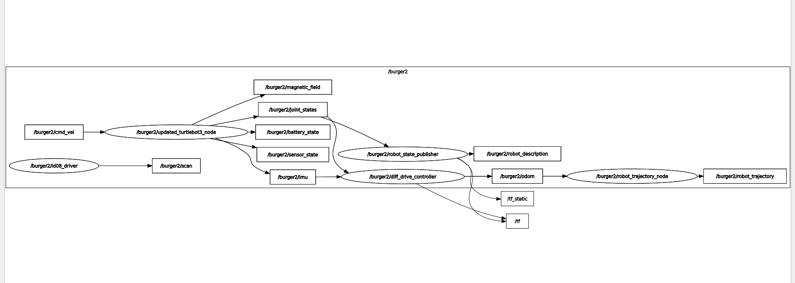

# BTP Doc
This ros2 package is the implementation of things i've done as part of my BTP under [Prof. Arnab Dey](https://www.iitr.ac.in/~EE/Arnab_Dey).    
This doc provides step by step process to setup this package & check the results on either the turtlebot3 hardware or in gazebo simulation.


## Requirements (apart from Turtlebot3 hardware)

- Ubuntu 22.04 LTS Desktop (in Remote PC)     
- ROS2 Humble (in Remote PC)   


## Install dependencies on Remote PC

- Update your debian packages :

  ```bash
  sudo apt update && sudo apt upgrade -y
  ```

- Make sure you have already setup the `Turtlebot3 hardware & software` before using this package:  

  In case you're looking for a quick guide to setup everything from scratch, you can look at the documentation i prepared - [Turtlebot3 Complete setup guide](https://gist.github.com/ab31mohit/bae0ecfa002597c900024a4800a0c9e4).


- Install gazebo11-classic to simulate (in case you want to) your work & other turtlebot3 dependencies (necessary in all cases) :

  ```bash
  sudo apt install gazebo -y
  sudo apt install ros-humble-gazebo-* -y
  sudo apt install ros-humble-cartographer -y
  sudo apt install ros-humble-cartographer-ros -y
  sudo apt install ros-humble-tf-transformations -y
  sudo apt install ros-humble-tf2-tools -y
  sudo apt install ros-humble-navigation2 -y
  sudo apt install ros-humble-nav2-bringup -y
  sudo apt install ros-humble-dynamixel-sdk -y
  sudo apt install ros-humble-turtlebot3-gazebo -y
  ```

<!-- Source your gazebo11 environment    
```
echo "source /usr/share/gazebo/setup.sh" >> ~/.bashrc
source ~/.bashrc
```

Run gazebo to see if everything is working    
```
gazebo --verbose
```
It should open the following window (I'm running it in WSL2)
<div align="center">
  
</div>  -->


## Setting up the project  

### 1. Create a ros2 workspace for this project in your remote PC :

- Open terminal and type these commands :

  ```bash
  cd ~
  mkdir -p ~/btp_ws/src
  cd ~/btp_ws/src
  git clone -b humble-devel https://github.com/ROBOTIS-GIT/turtlebot3_msgs.git
  git clone -b humble https://github.com/ROBOTIS-GIT/turtlebot3.git
  cd ~/btp_ws/src/turtlebot3/
  rm -rf turtlebot3_cartographer/ turtlebot3_navigation2/
  cd ~/btp_ws/src/
  git clone https://github.com/ab31mohit/platoon.git
  cd ~/btp_ws/
  colcon build --parallel-workers 1
  echo "source ~/btp_ws/install/setup.bash" >> ~/.bashrc
  ```    

    Make sure all the above clones packages are built without any errors.    
    
    In some cases you might face some warnings after building. Just rebuild the workspace again and they'll be gone.

     
### 2. Configure ROS2 environment in your remote PC :

- Include Cyclone DDS implementation for ROS2 Middleware

  ```bash
  sudo apt install ros-humble-rmw-cyclonedds-cpp
  echo "export RMW_IMPLEMENTATION=rmw_cyclonedds_cpp" >> ~/.bashrc
  ```

- Export custom ROS_DOMAIN_ID for your entire project   

  ```bash
  echo "export ROS_DOMAIN_ID=13"
  ```
  I'm using `13` as my ros domain id. You can use anything between 0 and 255.    
  
  But make sure it is same for all the robots and your system to ensure same ros environment for everyone.

- Export the TURTLEBOT3_MODEL environment variable in your remote PC's `.bashrc` file:    

  ```bash
  echo "export TURTLEBOT3_MODEL=burger" >> ~/.bashrc
  ```

  Make sure to change the model, according to the hardware you are using. (like burger, waffle, waffle_pi)

- Export the TURTLEBOT3_NAMESPACE in your remote pc

  ```bash
  echo "export TURTLEBOT3_NAMESPACE=default_ns" >> ~/.bashrc
  ```     
  ***Note:***   
1. Make sure to change this namespace according to your robot.                                                              

2. This namespace is used to connect to a specific robot (within the platoon) to access its topics.                         

3. This namespace values are supposed to form a specific pattern which is TURTLEBOT3_MODEL_INSTANCE.                        

4. For instance, the first burger will have namespace as burger1 & third waffle_pi will have wafflepi3 as its namespace. 

### 3. Configure ROS2 environment in your SBC (Robots' RPI) :    

Considering you have already configured setup as mentioned [here](https://gist.github.com/ab31mohit/bae0ecfa002597c900024a4800a0c9e4), follow the below steps to configure this package.    

- SSH into the Robot's RPI into your Ubuntu-22 by connecting both to same local network :

  ```bash
  ssh user_name@ip_address_rpi
  ```    
  Change *user_name* and *ip_address_ip* to the username & ip_address of your SBC's RPI.

- Export the  ROS_DOMAIN_ID in RPI same as we did for remote PC :  

  ```bash
  echo "export ROS_DOMAIN_ID=13" >> ~/.bashrc
  ```
- Export namespace for your robot in RPI :    

  ```bash
  echo "export TURTLEBOT3_NAMESPACE=default_ns" >> ~/.bashrc
  ```    
  By defualt, the `default_ns` will be used.    
  
  Make sure to change it according to your Robot's Model & Instance.    
  
  Pattern for writing namespaces have been specified above in this doc.

- Clone this package in RPI :    

  ```bash
  git clone https://github.com/ab31mohit/platoon.git
  ```

- Build the `turtlebot3_ws` in RPI : 
  
  ```bash
  cd ~/turtlebot3_ws/
  colcon build
  ```
- Update the params in this package according to your robot namespace : 

  ```bash
  cd ~/turtlebot3_ws/src/platoon/robot_bringup/src/
  python3 update_ns_param.py
  ```    
  It will take the robot namspace environment variable and use it to set params.     
  
  This will ensure all the important topics of this robot are initiaised with a certain namespace (that you've set before).    
  
  Do note that, runnniing this file is a one time process for setting up SBC(or RPI) of your robot.    
  
  Although you don't need to run this on your remote pc, as the bringup file will be running from SBC and it will automatically set the namespaces according to what has been set in params.    


## Using the package 

<!-- ### 1. Simulating multiple goal waypoints in gazebo :  
- Launch the gazebo world   
```
ros2 launch turtlebot3_gazebo empty_world.launch.py
```
- Launch the rviz in a new terminal
```
ros2 launch btp_pkg rviz.launch.py
```
- Run the waypoints node in a new terminal
```
ros2 run btp_pkg waypoints_node.py
```
The default waypoints are as follows :   
`[ (3.0, 1.0), (4.0, 2.0), (2.0, 3.0) ]`   

We can change the number of waypoints and their values but there is still some need of improvement to consider all cases.   

The output should be something like this : 
<div align="center">
  
</div>  -->

In this step you will bringup all the robots by connecting them to same network and also connect your remote PC to the same network.   

You will need to know the ip addresses of all those robots so that you can SSH into them (for running their bringup nodes) from your Remote PC.     

### 1. Run bringup launch file for all the robots from your remote PC :    

- SSH into your robot's SBC from remote PC : 

  ```
  ssh rpi_username@rpi_ip-address
  ```   
  Replace *rpi_username* & *rpi_ip-address* to the username & ip address of your specific robot's RPI.    

- Run bringup file for the robot via above SSH connection :  

  ```
  ros2 launch robot_bringup robot_bringup.launch.py
  ```   
  The log of this file should look like something like this  

    <div align="center">
    
    </div>   

  Here, I'm running ***burger*** (TURTLEBOT3_MODEL) with the namespace ***burger3*** (TURTLEBOT3_NAMESPACE).   
  
- Open a new tab in the remote PC & run : 
 
  ```
  ros2 topic list
  ```   
  If you're following everything correctly, it will show the topics started by bringup launch file of this robot in your remote PC.    
  
  The reason for this because of the same network and ROS_DOMAIN_ID between your remote PC and Robot's RPI.   
  
  It will show the topics something like this :    

    <div align="left">
    
    </div>   

  Here all the topics of this robot are namespaced with ***burger3*** as i used this as the namespace for this robot except `/tf` and `/tf_static`.   

- To understand the transforms that are being used in the background, run :  
  
  ```
  ros2 run tf2_tools view_frames
  ```    
  It will read the topics data from `/tf` and `/tf_static` and save the transforms in a pdf file within the current directory.     

  The content of that file will be like this    

    <div align="center">
    
    </div> 

  Now you can understand that we've only namespaced the frames ***odom*** and ***base_footprint*** of the robot in the global trannsform topics /tf & /tf_static without namespacing these global topics.     
  This is becase we need a global transform data which can keep track of transform of all the robots.   
  My approach was to publish the transform data of all the robots onto global transform topics with namespaces and then there will one parent `global_odom` frame whose child will be all the sub odoms of the robots.      
  This `global_odom` will be on that `odom` frame of one of the robots (that we'll choose as our Leader robot in the platoon).    
  Just below you'll see that that i've namespaced all the nodes as well that are associated to the important topics of the robot (to differentiate them with that of others).     

- Understand flow of information using rqt_graph : 
To understand what i just said above and visualize how the information is travelling between nodes and topics within the ROS environment, we can use rqt_graph.    

- Run this command to open rqt_graph : 

  ```bash
  ros2 run rqt_graph rqt_graph
  ```    
  Refresh the rqt_window and select specific checkpoints and it will look something like this    

    <div align="center">
    
    </div>  
  It is clear that all the nodes and topics are namespaced except the */tf* and */tf_static* topics and i already gave the reason for that.   
  
The reason why i included this so that one can really understand what am i trying to do and how to visualize those changes.     

I hope you could understand this and can make changes accordingly if you want some.  

Now you need to repeat this process for all the robot's you're going to run simulataneously.     

To publish any data like velocity or subscribe any data like imu, odom or scan make sure you are using the namespaced topic name of that specific robot.