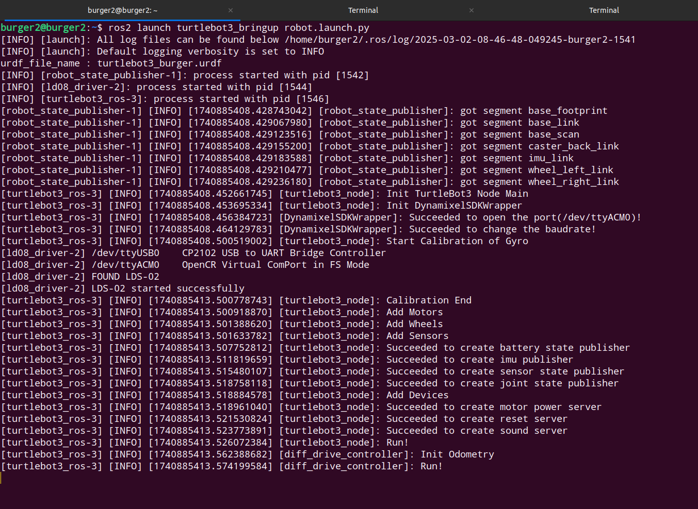

# Turtlebot3 Hardware setup   
This file includes step by step process to setup and run Turtlebot3 hardware.

## SBC Setup :   
- From the Turtlebot3 kit you would've got a RaspberryPi 4 (Model B or higher) where you will install the minimal Operating System onto the SD Card (provided in the kit) to run the base code for operating the Robot :    
    - In our case the minimal OS is the `Ubuntu-22.04.05 LTS Server (64-bit)`    
    - We need to Flash & install this OS onto RaspberryPi.    
- Download RPI imager for flash this OS onto Rpi - [RPI image download](https://www.raspberrypi.com/software/).
- Connect SD Card to your current system.
- Open RPI Image software and select the following :   

  Choose Device --> `Raspberry Pi 4`    
  Choose OS --> `Other gerneral-purpose OS` --> `Ubuntu` --> `Ubuntu Server 22.04.5 LTS (64-bit)`
  Choose Storage --> Your target storage/SD Card
  
- Select `Next` and wait for it to write & verify.  

- *Here is a video demonstration for this :*    

https://gist.github.com/user-attachments/assets/8d7ea105-5a24-42cd-ab8e-456c5f0181e9

*`Note1:`* You can install RPI Imager on either windows or Ubuntu, steps will be the same. I would prefer saving the credentials of a local mobile hostspot in case you don't have a local wifi Router.      
(Note1: ends here)
- Configuring the RPI OS :    
    - Insert SD Card into Rpi, Connect Rpi to Monitor using HDMI Cable and Power the Rpi using Type-C Cable & an adaptor (preferably of higher wattage like 18-45W)

    
    
   - Login with the username and password that you earlier set in the RPI Image software.     
   - Make sure the network (whose credentials you set earlier in the RPI Image software) is already ON.
   - Check if you are connected to a network or not by checking IP Address of you Rpi   
    
   ```bash
   hostname -I
   ```      
   If it outputs a value, that means you are good to go. If not, then make sure the network is on.    


- Installing ROS2-Humble on RPI :   
    - Follow this link and write the commands step by step on the RPI - [Install ROS2-Humble](https://docs.ros.org/en/humble/Installation/Ubuntu-Install-Debs.html). 
    - Source ROS2 Global environment on RPI
    
    ```bash
    echo "source /opt/ros/humble/setup.bash" >> ~/.bashrc
    ```
    - Build turtlebot3 packages on RPI   
    
    ```bash
    sudo apt install python3-argcomplete python3-colcon-common-extensions libboost-system-dev build-essential
    sudo apt install ros-humble-hls-lfcd-lds-driver
    sudo apt install ros-humble-turtlebot3-msgs
    sudo apt install ros-humble-dynamixel-sdk
    sudo apt install libudev-dev
    mkdir -p ~/turtlebot3_ws/src && cd ~/turtlebot3_ws/src
    git clone -b humble https://github.com/ROBOTIS-GIT/turtlebot3.git
    git clone -b humble https://github.com/ROBOTIS-GIT/ld08_driver.git
    cd ~/turtlebot3_ws/src/turtlebot3
    rm -r turtlebot3_cartographer/ turtlebot3_navigation2/ turtlebot3_example/
    cd ~/turtlebot3_ws/
    colcon build --parallel-workers 1
    echo "source ~/turtlebot3_ws/install/setup.bash" >> ~/.bashrc
    source ~/.bashrc
    ```
- Run these commands to set PORT for OPENCR setup :   

    ```bash
    sudo cp `ros2 pkg prefix turtlebot3_bringup`/share/turtlebot3_bringup/script/99-turtlebot3-cdc.rules /etc/udev/rules.d/
    sudo udevadm control --reload-rules
    sudo udevadm trigger
    ```
- Export the turtlebot3 domain id (must be same as that of your Remote PC) :   

    ```bash
    echo "export ROS_DOMAIN_ID=13 #TURTLEBOT3" >> ~/.bashrc
    source ~/.bashrc
    ```
- Export the LDS (Laser Distance Sensor) Model for Turtlebot3 (Current updated version is LDS-02) : 

    ```bash
    echo 'export LDS_MODEL=LDS-02' >> ~/.bashrc
    source ~/.bashrc
    ```
- Export the TURTLEBOT3_MODEL environment variable : 

    ```bash
    echo 'export TURTLEBOT3_MODEL=burger' >> ~/.bashrc
    source ~/.bashrc
    ```   
  Here i'm uring burger, in your case it might be a `waffle` or `waffle_pi`.


## Bringup Test :

1. Make sure both your `Remote PC` & `Turtlebot3 Rpi` are connected to same wifi network.   

2. SSH into your RPI from your Remote PC's ubuntu-22 terminal.   

3. Run bringup file : 

    ```bash
    ros2 launch turtlebot3_bringup robot.launch.py
    ```   
    The log of this file should look like something like this  
    <div align="left">
    
    </div>   

  Here, I'm running ***burger*** (TURTLEBOT3_MODEL)

4. Open another tab of the terminal and run :    

    ```bash
    ros2 topic list
    ```    
    It should output topics similar to this   
    <div align="left">
    
    </div>

5. Run rviz to visualize the robot : 

    ```bash
    ros2 launch turtlebot3_bringup rviz2.launch.py
    ```   

4. Teleoperate the robot :  

    ```bash
    ros2 run turtlebot3_teleop teleop_keyboard
    ```